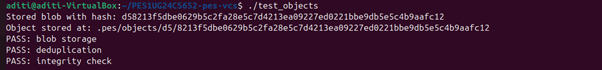
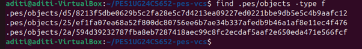
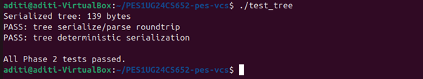
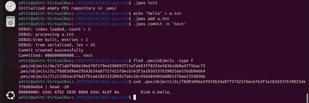
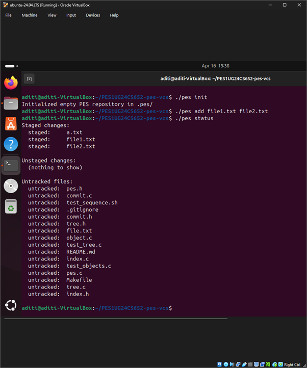
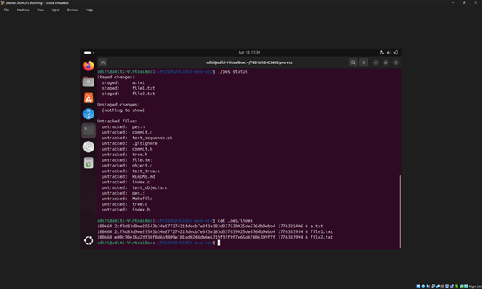
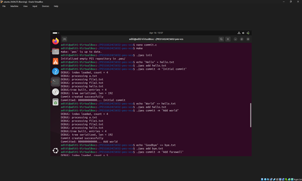
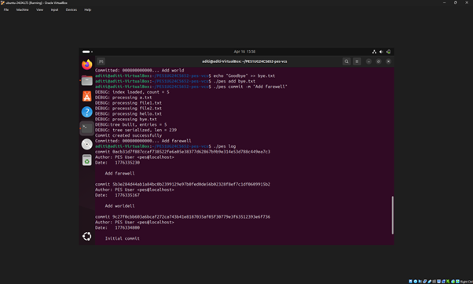
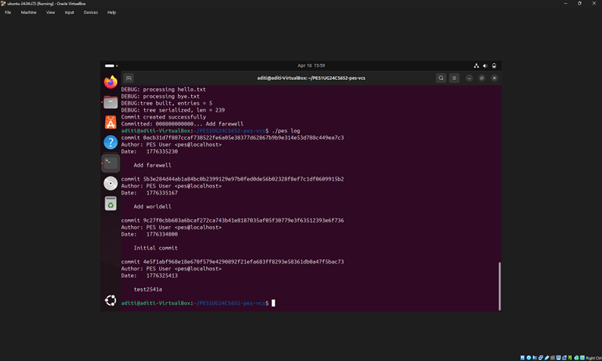

# OS Orange Problem 2 – PES VCS

**Name:** Aditi Hubli  
**SRN:** PES1UG24CS652  

---

# 📌 Phase 1: Object Storage Foundation

## 🔹 Objective
In this phase, the goal was to implement the foundational object storage system similar to Git. This includes storing file contents as objects using hashing and retrieving them correctly.

## 🔹 Implementation Details
- Implemented functions in `object.c`
- Objects are stored inside `.pes/objects/`
- Each object is identified using a hash value
- Object data is written in a structured format and retrieved correctly
- Ensured correctness using provided test cases

## 🔹 Output Verification

### Screenshot 1A: Output of `./test_objects`

### Screenshot 1B: Object files in `.pes/objects`

---

# 📌 Phase 2: Tree Objects

## 🔹 Objective
This phase focuses on representing directory structures using tree objects, similar to how Git tracks directories.

## 🔹 Implementation Details
- Implemented tree creation and serialization in `tree.c`
- A tree represents a snapshot of the directory structure
- Each tree entry contains:
  - file/directory name
  - mode
  - hash reference
- Trees are recursively constructed from index entries
- Serialization ensures consistent binary structure for storage
- Tree objects are written to the object store using hashing

## 🔹 Output Verification

### Screenshot 2A: Output of `./test_tree`

### Screenshot 2B: Tree object hex dump

---

# 📌 Phase 3: The Index (Staging Area)

## 🔹 Objective
To implement a staging area (index) that tracks files before committing, similar to Git’s staging system.

## 🔹 Implementation Details
- Implemented in `index.c`
- Index file stored at `.pes/index`
- Each entry contains:
  - mode
  - hash (object ID)
  - modification time (mtime)
  - file size
  - file path
- Implemented functions:
  - `index_load` → reads index file and initializes structure
  - `index_save` → writes index using atomic write (temp file + rename)
  - `index_add` → stages files and updates index entries
- Entries are sorted before saving
- Used metadata (mtime and size) to detect changes efficiently

## 🔹 Output Verification

### Screenshot 3A: `./pes init`, `./pes add`, `./pes status`

### Screenshot 3B: Contents of `.pes/index`

---

# 📌 Phase 4: Commits and History

## 🔹 Objective
To implement commit functionality and maintain commit history using linked structures stored on disk.

## 🔹 Implementation Details
- Implemented `commit_create` in `commit.c`
- Commit creation involves:
  1. Building a tree from the index using `tree_from_index()`
  2. Reading the current HEAD as the parent commit (if it exists)
  3. Getting author information using `pes_author()`
  4. Filling commit structure with:
     - tree hash
     - parent hash
     - author
     - timestamp
     - commit message
  5. Serializing commit using `commit_serialize`
  6. Writing commit object to `.pes/objects`
  7. Updating HEAD using `head_update()`
- Commits form a linked structure via parent references

## 🔹 Output Verification

### Screenshot 4A: Output of `./pes log`

### Screenshot 4B: Object store after commits

### Screenshot 4C: HEAD and branch reference

---

# 📌 Phase 5 & 6: Analysis

## Q5.1: Checkout Implementation
A checkout updates `.pes/HEAD` to point to the selected branch (`ref: refs/heads/<branch>`). It then reads the commit of that branch, loads its tree, and updates the working directory to match that snapshot (creating, modifying, and deleting files accordingly).  
This is complex because it must safely handle differences between the working directory, index, and target commit, and avoid overwriting uncommitted changes.

---

## Q5.2: Dirty Working Directory Detection
To detect a dirty working directory, compare each file in the index with the working directory using metadata (mtime, size). If changed, recompute the file’s hash and compare with the stored hash.  
If a file differs from the index and also differs in the target branch, a conflict exists, so checkout must be refused.

---

## Q5.3: Detached HEAD
In a detached HEAD state, HEAD points directly to a commit instead of a branch. New commits created in this state are not referenced by any branch and may become unreachable.  
A user can recover them using the commit hash or by creating a new branch pointing to that commit.

---

## Q6.1: Garbage Collection
Garbage collection uses a mark-and-sweep algorithm. Starting from all branch heads, traverse commits, trees, and blobs, marking all reachable objects. Then delete all objects not marked.  
A hash set is used to efficiently track reachable objects. For a large repository, around hundreds of thousands to a million objects may be visited.

---

## Q6.2: GC Race Condition
Running garbage collection during a commit can cause a race condition where GC deletes objects that are created but not yet referenced by a commit. This can corrupt the repository.  
Git avoids this by writing objects first, updating references atomically, and delaying deletion of recent objects to ensure safety.

---
